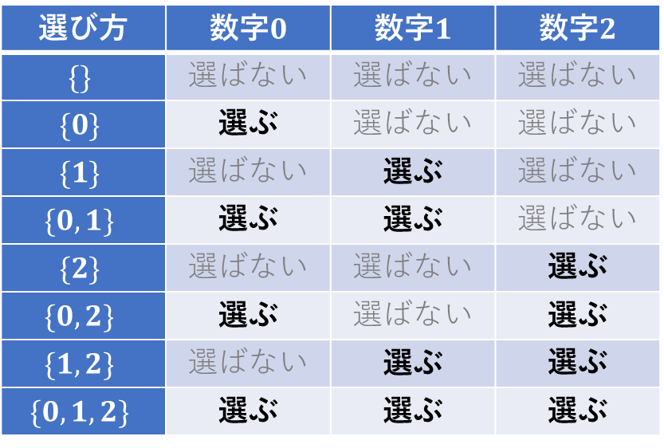
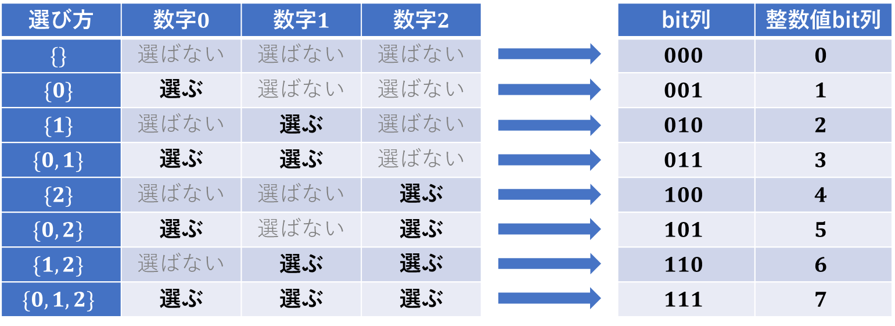

## 概要

bit全探索とは、$N$ 個のものから「いくつか選ぶ方法」を全列挙して探索するアルゴリズムです。通常のforループでは全探索できない $2^N$ 通りを全探索できるようになります。

**「いくつか選ぶ方法」の全列挙**というのは **$N$ 個の各々について「選ぶ・選ばない」** を全て列挙するということです。

簡潔に言うと $N$ 個の要素を持つ集合 $\{0,1,2,\dots,N-1\}$ の部分集合の全列挙ができます。

## 例題

例題を通して、どのように全探索を行うかを理解しましょう。

> 【問題】<br>
$N$ 個の整数 $A_1,A_2, \dots,A_N$ が与えられたとき、その中からいくつか選ぶ方法を列挙せよ。<br>【制約】<br>$N \leq 20$
> 

この問題をforループで解こうとすると、$N$ 重のfor文が必要になります。また、 $N$ の値は変わるのでfor文の数を固定して書くことができません。

より分かりやすいように先程の例題の $N=3$ のときの場合を考えます。

> 【問題】<br>
3個の整数 $0,1,2$ が与えられたとき、その中からいくつか選ぶ方法を列挙せよ。
> 

数学が得意な方であれば $2^3 = 8$ 通りあることは容易に分かると思いますが、これはどのようにして導き出したのかを考えていきましょう。

まず、3個ある整数ごとに選択肢として「選ぶ」「選ばない」の2通りが存在します。 $0,1,2$ について

- $0$ を選ぶ or $0$ を選ばない
- $1$ を選ぶ or $1$ を選ばない
- $2$ を選ぶ or $2$ を選ばない

が存在します。下図のとおり、 $2^3 = 8$ 通りあることになります。



この問題であれば3重のfor文でも全パターンを列挙することは出来ますが、bit全探索を行って全パターンを列挙してみましょう。

## bit全探索の実装

基本的にbit全探索を実装するときの方針は以下の通りです。

こちらの表現を用いて説明します。

- 「いくつか選ぶ方法」を2進数で表したものを**bit列**
- bit列を10進数の整数値に置き換えたものを**整数値bit列**

<aside>
💡 方針

1. **いくつか選ぶ方法をbit列(2進数)で表し、bit列→整数値bit列に変換する**
2. **整数値bit列→bit列に変換し、選ぶ方法を復元する**
3. 復元した選ぶ方法について処理を行う
4. 1-3を $2^N$ 通り全てに行う
</aside>

### いくつか選ぶ方法をbit列(2進数)で表す

はじめに、「いくつか選ぶ方法」をbit列で表す方法を考えます。

例えば、 $\{0,1,2\}$ に対して$\{1,2\}$ を選ぶ方法は $\{0,1,2\}$ の1番目である $0$ は選ばず、2番目、3番目である $1,2$ を選んでいるので、$N$ 桁のbit列で  $011_{(2)}$ と表せます。

つまり、これだけで「いくつか選ぶ方法」bit列で表すことができます。

- **$i$ 番目のものを選ぶなら、bit列の $i$ 桁目を1にする**
- **$i$ 番目のものを選ばないなら、bit列の $i$ 桁目を0にする**

### bit列→整数値bit列に変換する

次に、選ぶ方法を表したbit列を10進数に直して整数値bit列に変換します。 これにより、整数値と選び方を対応させることができ、非常に扱いやすくなります！

例題の8つの選び方について、bit列と整数値bit列ではこのように表すことができます。



### bit全探索するためのfor文

   $2^N$ 個ある整数値bit列 $0,1,2,...,2^N-1$ までをfor文を用いて全探索します。

先程、整数値と選び方を対応させたことにより、forループで「いくつか選ぶ方法」を全て探索することができるようになりました。

```cpp
for(int bit = 0; bit < (1 << N); bit++){
    /* 整数値bitで表した集合に対して、処理 */
}
```

- コード内の **`1 << N` は1をN桁左シフトした値 = $2^N$ のこと**です。

### 整数値bit列→bit列に変換し、選ぶ方法を復元する

「いくつか選ぶ方法」を整数値に対応させましたが、このままだとその整数が「どう選ぶことを意味しているのか」がわからないので、先程と逆のことを行い復元します。つまり、

- 整数値bit列 $0,1,2,...,2^N-1$ を再びbit列で表す
- bit列で表される「選び方」において、「i番目を選んだかどうか」を判定する

ことを行います。以下のコードによって整数値bit列から「いくつか選ぶ方法」を復元しているのです。

```cpp
// 復元処理
// bitのi桁目(i番目のもの)は1(選んだ)かどうか
if((bit >> i) & 1){
    /* 選んだものに対して処理 */
}
```

このif文は整数値bit列 $0,1,2,...,2^N-1$ それぞれについて、

- **再びbit列で表したとき、 $i$ 桁目が1かどうか( $i$ 番目のものを選んだかどうか)**

を判定しています。

例えば、$N=3,\text{bit} = 4$ のとき、`if((bit >> i) & 1)` はどのように判定を行うのか考えます。

$\text{bit}$ を2進数で表すと $101_{(2)}$ になる、$i = 0,1,2$ のときの判定は以下の通りです。

| i | (bit >> i) | (bit >> i) & 1) | 判定 |
| --- | --- | --- | --- |
| 0 | 101 | 101 & 001=001 | True |
| 1 | 010 | 010 & 001=000 | False |
| 2 | 001 | 001 & 001=001 | True |

`(bit >> i)`は $\text{bit}$ を $i$ 桁右シフトした値であり、これと $1$ をAND演算で判定をすることで

- **$ \text{bit}$ の $i$ 桁目の値が1のとき、True**
- **$ \text{bit}$  の $i$ 桁目の値が0のとき、False**

となります。$1$ は最下位bit以外全て0になっているので、AND演算によって最下位bitを残して全て0にします。ですので実際は

- bitの $i$ 桁右シフトした値の最下位bitが1なら、True (最下位Bit以外の桁は0)
- bitの $i$ 桁右シフトした値の最下位bitが0なら、False (全ての桁は0)

と判定していることになります。

bitに対して、頻出な判定の書き方は以下の通りです。

| 判定 | 書き方 |
| --- | --- |
| bitのi桁目が1かどうか(i番目を選んだかどうか) | `if((bit >> i) & 1)` |
| bitのi桁目が1ではないかどうか(i番目を選んでいないかどうか) | `if(!((bit >> i) & 1))` |
| bitの1の個数(選んだ個数) | `__builtin_popcount(bit)` |

## 実装


例題の実装は以下の通りです。 $N$ の値を変えればどのような場合でも対応できます。

## 計算量

$O(N2^N)$<br>
$N \leq 20$ くらいなら間に合います。 

```cpp
// N: 何個のものについて考えているか
// bit: 選び方の集合を表す整数値
int N = 3;
// 2^N通りの選び方を 0,1,2,...,2^N-1 の整数値に対応
for(int bit = 0; bit < (1 << N); bit++){
    /* bitで表した集合に対して、処理 */

        // bitで表した集合Sを求める
    vector<int> S;
        // 各iに対して
    for(int i = 0; i < N; i++){
        // bitのi桁目は1(選んだ)かどうか
        if((bit >> i) & 1){
            S.push_back(i);
        }
    }

        // bitで表した集合Sの出力
        cout << bit << ": ";
        for(auto&& v: S){
            cout << v << " ";
        }
        cout << endl;
}
```

```
0: 
1: 0 
2: 1
3: 0 1
4: 2
5: 0 2
6: 1 2
7: 0 1 2
```

- `if((bit >> i) & 1)`は`if(bit & (1 << i)`と書くこともできますが、本質は同じです。
- 実際の問題では配列Sを作成することはほとんどありません。その代わり
    - 各 $i = 0, 1,\dots$に対して
    - $i$ がbitで表される集合に含まれることが分かったら
    - それに応じた処理をその場で行う
    
    という場合がほとんどです。
    

## 練習問題

bit全探索で解ける問題を置いておきます。 [bit全探索例題](https://jikky.notion.site/bit-6f60d4392c394b3fa4d49fdeb14c822a) 

## 参考文献

- **[ビット演算 (bit 演算) の使い方を総特集！ 〜 マスクビットから bit DP まで 〜 - Qiita](https://qiita.com/drken/items/7c6ff2aa4d8fce1c9361)**
- [**bit 全探索 - けんちょんの競プロ精進記録**](https://drken1215.hatenablog.com/entry/2019/12/14/171657)
- **[ビット全探索（ 2^n 通りの全探索） | アルゴリズムロジック](https://algo-logic.info/rec-bit-search/)**
- **[こわくないbit全探索1 入門編: bit全探索ってなに？【競プロ解説】 - Qiita](https://qiita.com/u2dayo/items/68e35815659b1041c3c2)**